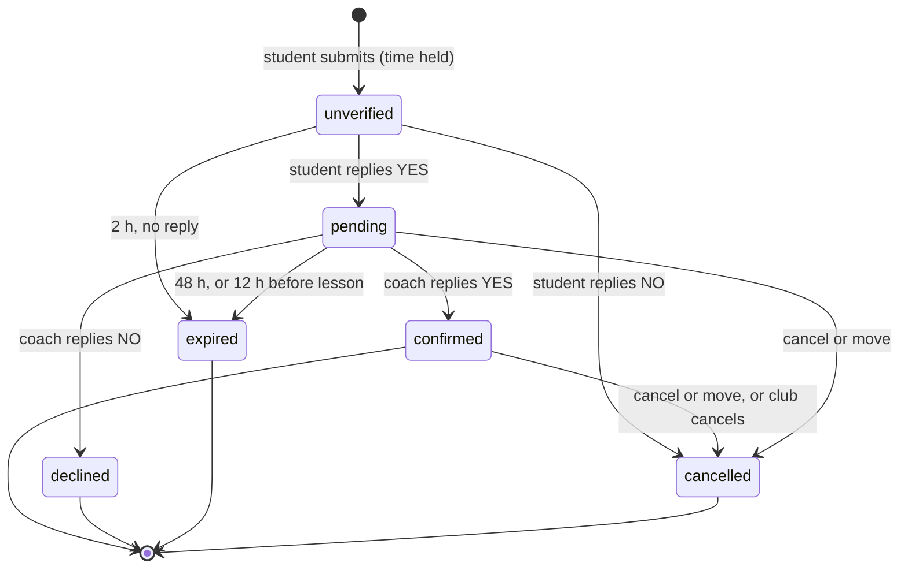

# Coaching app: where is a booking stuck?

How to find exactly which step a lesson request, a coach's times, or a change
is at, who has to act next, what they were sent, and what can go wrong. The
source of truth is the **private** Sheet (`CTTC Coaching (private - do not
share)`); the public Sheet and the booking page only show a summary. All code
references are to [`coaching-app/Code.js`](../coaching-app/Code.js).

> Keep real names, emails and phone numbers out of issues and commits when
> using this guide. Describe a case by date, time, coach first name and status.

## 1. Two-minute triage

1. Open the private Sheet, **Requests** tab. Find the row by `date`
   (`2026-10-16`) and `start` (`21:00`, 24-hour Pacific). A move creates a
   *new* row, so check every row for that student (`student_email`).
2. Read `status`, then check `expires_at` against now. `expires_at` is
   milliseconds since 1970 (UTC). In the Sheet, `=EPOCHTODATE(M2/1000)` gives
   the time in UTC; subtract 7 hours for PDT or 8 for PST. A waiting status
   whose `expires_at` has passed is already **expired** in the app, even
   before the hourly sweep writes it.
3. Use the table below.

| `status` | Meaning | Who must act | What they were sent | Deadline | Public board shows |
| --- | --- | --- | --- | --- | --- |
| `unverified` | Student submitted the form; nothing has gone to the coach. | **Student**: reply YES. | Email *Confirm your coaching request [CTTC ref …]*. Also a text if the student texted STUDENT earlier (`Students.texts = yes`). | 2 hours after submitting (`VERIFY_MS`), or sooner for a lesson that is close. | "Waiting for Student … to confirm" |
| `pending` | Student said YES (`verified_at` set). The coach has been asked. | **Coach**: reply YES or NO. | Coach: email *Lesson request from {student} [CTTC ref …]*, plus a text if the coach has a mobile on the list. Student: email *Coaching request sent to Coach … (not confirmed yet)*. | The earlier of 48 hours after the YES, or 12 hours before the lesson (`HOLD_HOURS`, `RELEASE_BEFORE_HOURS`). | "Waiting for Coach … to accept" |
| `confirmed` | Coach said YES. Done. | Nobody | Both: *Lesson confirmed: {date} {start}*, with each other's contact details. Texts too if opted in. | n/a | "booked" |
| `declined` | Coach said NO. | Nobody (student may pick another time) | Student: *Coaching request not accepted*. | n/a | time is open again |
| `expired` with empty `verified_at` | Student never replied YES. | Nobody | Student: *Coaching request expired: we did not get your YES*, with the steps to book again. Coach was never told. | n/a | time is open again |
| `expired` with `verified_at` set | Coach never answered. | **Club** should follow up with the coach | Student and coach both, with the club cc'd (`ADMIN_EMAIL`): *…expired: the coach did not answer* / *Lesson request expired: no answer*. | n/a | time is open again |
| `cancelled`, `cancelled_by = student` | Student replied NO to the confirm email, or confirmed a cancel. | Nobody | Student: *Coaching lesson cancelled*. Coach: *Lesson cancelled by {student}*, only if the coach had been asked (`verified_at` set). | n/a | time is open again |
| `cancelled`, `cancelled_by = move` | Student moved to another time; look for the new row (status `pending`). | See the new row | Coach of the old time: *Lesson cancelled by {student}* ("moved"). | n/a | old time open; new time "requested" |
| `cancelled`, `cancelled_by = coach` | Set by hand by the club after a coach asked to cancel (coaches reply to their confirmation email; the app does not do this itself). | Nobody | Student: *Lesson cancelled by your coach*. | n/a | time is open again |

`proposed` appears in the code's status checks but is never set; ignore it.

The booking board, schedule list, coach page and public Sheet say who owes
the next reply: **"Waiting for Student … to confirm"** (`unverified`) or
**"Waiting for Coach … to accept"** (`pending`). Before this was added (the
`/exec` release of 2026-10-10 and earlier) both showed only "requested".

## 2. Did each message actually go out?

Each person is told about each status **once**. These columns record the last
status each side was told about. They are written only after the send
succeeded, so a mismatch means the message has not gone out yet:

| Column | Holds | Example reading |
| --- | --- | --- |
| `student_emailed` | the `status` the student was last emailed about | `status = unverified`, `student_emailed` empty → **the confirm email never went out** |
| `coach_emailed` | the `status` the coach was last emailed about | `status = pending`, `coach_emailed` empty → the coach has not been emailed |
| `coach_texted` | `pending` once the coach was **asked** by text; afterwards the last status texted | `status = pending`, `coach_texted` empty → the coach has not been texted (no mobile, never texted COACH, or another question is open, see §4) |
| `student_texted` | the last status texted to the student | only for students with `Students.texts = yes` |

**Reminders.** A request still waiting gets one reminder per step, sent by
the sweep: the student 1 hour after asking (*Reminder: Confirm your coaching
request [CTTC ref …]*, plus a text if they get texts), and the coach 2 hours
after the student's YES (*Reminder: Lesson request from {student} [CTTC ref
…]*, plus the text question again if it is the coach's open one). At that
point the student is also emailed *Your coaching request is waiting on Coach
…*. Reminders keep the original reference code, so a reply to either email
counts. The `reminded` column holds the step (`unverified` or `pending`)
already reminded. No reminder is sent within 10 minutes of the deadline, and
the coach never hears about a request before the student's YES.

Unsent messages are retried by every sweep (hourly, and after every booking
or answer), but only while `updated_at` is under 3 days old
(`RETRY_MAIL_DAYS`) and the daily mail quota is above 10 (`MIN_QUOTA`). After
that the app gives up silently.

## 3. The request lifecycle

A change (cancel or move) does **not** change `status` until the student
confirms. While it waits, the row has `change = cancel` or
`change = move:{avail_id}` and `change_at` (ms). The student is emailed
*Confirm: cancel your lesson [CTTC ref …]* or *Confirm: move your lesson
[CTTC ref …]*. A move is applied only if the new time is still open when they
reply YES; the new row starts at `pending` (the coach is asked straight away).

## 4. How replies are recognised (the usual place things stick)

Answers are read by the `checkTexts` trigger, which runs every minute.

**Email replies** (`checkMail_`) count only if **all** of these hold:

- the reply's subject still contains the `[CTTC ref XXXXXXXXXX]` code (a normal
  "Reply" keeps it; editing the subject or writing a new email loses it);
- it comes **from the address the question went to** (case, and for Gmail
  dots and `+tags`, do not matter). A reply from another account, alias or
  relay address (for example Apple's *Hide My Email*) does not count, but the
  sender is told to reply from the right address and the club is alerted;
- the person's own words say **yes** or **no**, in any case and with other
  words around it (`Yes, see you Friday`, `no thanks`, `y`, `yep`, `nope`).
  The quoted earlier message (`On … wrote:`, `>` lines, `-------- Original
  message --------`, an Outlook `From:` block) and `Sent from my …`
  signatures are ignored, since our own emails say both "Reply YES" and
  "Reply NO". `no problem` / `no worries` are not a no. A reply with both or
  neither is not guessed at: the sender is asked to reply again and the club
  is told;
- it arrives within 3 days and after the question was asked, and the
  question is still open.

**Text replies** go through the club's Google Voice number, forwarded to Gmail:

- The app can only text someone who has **texted the club number first**:
  coaches text `COACH` once (this sets `Coaches.registered_at`), students text
  `STUDENT` (sets `Students.texts = yes`, `texts_at`).
- The sender is matched by the mobile number on the list, or by the Google
  Voice contact name matching the name on the list.
- Each person has **one open question at a time** (`ask_ref`, `ask_at` on the
  Coaches or Students row). A bare YES answers that one question. Coaches:
  `ask_ref` is `slots` or a `request_id`; students: `v:{request_id}`
  (confirm) or `c:{request_id}` (change). Other pending requests are texted
  after the open one is answered; a fresh request replaces an open question
  only after 10 minutes (`PROPOSE_WAIT_MS`).

A reply is never ignored silently any more: an unreadable reply or a wrong
address gets an explanation, and the club is emailed. A failing step of the
minute check (for example Google Voice) no longer stops email answers being
read; the club is emailed about it at most every 6 hours. A student's YES
sent before the deadline but read after it still counts if the time is free.

## 5. Coaches' offered times

| Where | What it tells you |
| --- | --- |
| **Coaches** `ask_slots` (JSON) and `ask_made` (ms) | The coach submitted times on the page and we are waiting for their YES (email *Confirm your coaching times [CTTC ref …]* and/or a text). Nothing is published until then. The list lapses after 24 hours (`ASK_TTL_MS`). |
| **Coaches** `registered_at` | The coach's texts work (they texted the club number). Empty means texting them fails. |
| **Coaches** `status = disabled` | The coach and all their times are hidden. |
| **Availability** rows with `confirmed = yes` | Published times. A row is one slot: `minutes` 30 or 60, `table` 1 to 3. A 25-minute booking on a 60-minute slot splits it into two 30-minute rows. Past rows are deleted by the sweep. |
| **Waitlist** | People emailed (*A coaching time you wanted is open*) when a held time frees up; each is removed once told. |

Students can only request times that are confirmed, **at least 24 hours away**
(`LEAD_HOURS`) and **at most 28 days ahead** (`HORIZON_DAYS`), on Fridays 7 to
10 PM or Saturdays 3 to 6 PM Pacific.

## 6. What the page said, and what it means

| Message on the page | What happened |
| --- | --- |
| "Almost done: we emailed you… Reply YES… within 2 hours" | Saved as `unverified`. Waiting for the student. |
| "That time is no longer available. Please pick another." | Someone holds that time, **including the same student's own earlier request**. Look for an existing row before assuming a bug. |
| "You already have 2 requests waiting for an answer." | The student has 2 `unverified`/`pending` rows (`MAX_OPEN_REQUESTS_PER_STUDENT`). |
| "Too many requests right now." | More than 30 calls in a minute across the whole app (`MAX_PER_MINUTE`). |
| "Requests are closed for now." | The Requests or Students tab hit its size cap (`MAX_REQUESTS`, `MAX_STUDENTS`). |
| "Something went wrong. Please try again." | The server threw an error (the page never shows the real message). Look in the Apps Script editor, **Executions**, for a failed `requestSlot`, `studentChange` etc. **Before the fix in this branch** a request could be saved and still show this (see §7). |

## 7. Known failure modes

| Symptom | Likely cause | Check | Fix |
| --- | --- | --- | --- |
| Page said "Something went wrong", retries say the time is taken, but a "requested" row exists for the student | Before `fix(coaching): never report a saved lesson request as a failure`, an error *after* saving (email, text, public Sheet rebuild) was shown as a failure. | Row is `unverified`; `student_emailed` may be empty. Executions show a failed `requestSlot`. | Fixed in code. For the stuck case, the next sweep sends the confirm email if it has not gone out. The student replies YES before `expires_at`. |
| Student says they replied YES but row is still `unverified` | Reply not recognised (§4): different address, edited subject, extra words on the first line, or too late. | Find the reply in the club Gmail. | Ask them to reply to the original email with just `YES`, or have them submit again after it expires. |
| Row is `pending` for a long time | Coach has not answered, or their answer was not recognised (§4). | `coach_emailed = pending`? `coach_texted = pending`? `Coaches.ask_ref` = this `request_id`? | Remind the coach to reply `YES` to the email or text. |
| Coach never gets texts | They never texted the club number, or the Voice contact name/number does not match the list. | `Coaches.registered_at` empty; `phone` column. | Have them text `COACH` to the club number. |
| No emails at all for a while | Daily mail quota low (sending pauses at 10 left), or Gmail/MailApp errors. | Executions log; `student_emailed`/`coach_emailed` lagging behind `status`. | Wait for the quota reset; the sweep retries for 3 days. |
| Time shows "closed" | It is under 24 hours away, so it no longer takes requests. Expected. | `date`/`start`. | None in the app. |
| Public Sheet out of date | It is rebuilt only after changes and hourly; a failed rebuild is logged, never fatal. | Executions log for "Could not update the public schedule". | Run `sweep` from the editor. |

## 8. Timing reference

| Constant | Value | Effect |
| --- | --- | --- |
| `VERIFY_MS` | 2 hours | time for the student's YES |
| `HOLD_HOURS` | 48 hours | max time for the coach's YES |
| `RELEASE_BEFORE_HOURS` | 12 hours | a waiting request expires this long before the lesson |
| `LEAD_HOURS` | 24 hours | no new requests closer than this |
| `HORIZON_DAYS` | 28 days | how far ahead times can be offered or requested |
| `ASK_TTL_MS` | 24 hours | a coach's submitted list of times lapses |
| `CHANGE_WAIT_MS` | 10 minutes | gap between cancel/move requests for one lesson |
| `REMIND_STUDENT_MS`, `REMIND_COACH_MS` | 1 hour, 2 hours | when the one reminder for each waiting step goes out |
| `RETRY_MAIL_DAYS` | 3 days | unsent messages are retried this long |
| Triggers | `checkTexts` every minute, `sweep` hourly | replies are picked up within about a minute |
